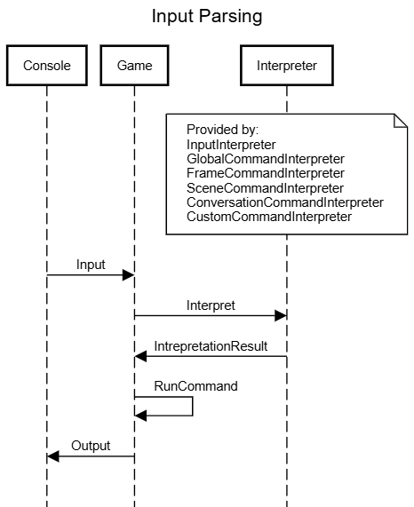

# Architecture Overview

## Overview
NetAF has a simple architecture and understanding it will help when developing games.

A *Game* encapsulates all assets and provides top level logic. When the *Game* is executing the following loop runs for the duration of the execution:
* The *Game* renders the current *GameMode*. There are many different instances of *IGameMode* that provide different functionality, but generally they can be split in to two types: *Interactive* and *Information*.
* The *Game* then accepts user input by using an instance of *IIOAdapter* to receive input from the user.
* The *Game* then and passes the input to its own *Interpreter* (for handling global input) and the *Interpreter* for the current *GameMode* (for handling mode specific input) in order to process it.
* The *Interpreter* tries to parse the input and if successful return an instance of *Command*.
* The returned *Command* is then invoked and returns a *Reaction* that details the result. Some instances of *ICommand* deal with interactions between assets. In this case an *Interaction* between an *Item* and a target is invoked and the result returned the *ICommand* which will return an appropriate *Reaction*.
* The *Game* processes the *Reaction*. Some instances of *Reaction* will trigger the *Game* to change *GameMode* to either display the *Reaction* or enter another*GameMode*.
* When a *GameMode* is rendered a *IFrameBuilder* can be used to generate an instance of *IFrame*.
* An instace of *IFrame* can be rendered on to an *IIOAdapter* which will display the *IFrame* to the user.

## Extensibility
NetAF is designed to be extensible.

* **ICommand** allows commands to be added.
* **IInterpreter** allows commands to be interpreted.
* **IGameMode** allows custom modes to be added to a *Game*.
* **IFrameBuilders** callows custom instances instances of *IFrame* to be created which are used to render the game state to the user.
* **IIOAdaper** provides an interface to get input from the user and render the game state back to them. *SystemConsoleAdapter* provides a wrapper around *System.Console*, however custom implementations can be added to support different types of application.
